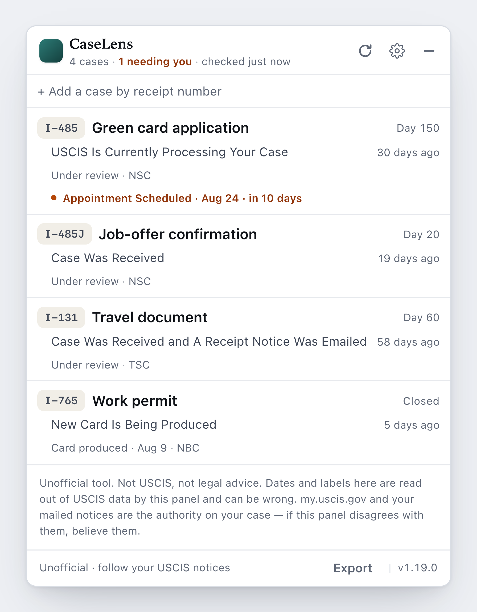

# CaseLens — USCIS Case Tracker

A panel that appears on [my.uscis.gov](https://my.uscis.gov) showing every case on your account in one place: status, a merged timeline, which office holds it, your documents, and what changed since you last looked. Free, open source, and stored only in your own browser — no account, no server.

  

Sample cases, not real data. <a href="docs/screenshots/panel-dark.png">Dark mode.</a>

## Is it safe?

- **It only talks to my.uscis.gov**, the site you're already logged into. There is no other server it knows how to reach.
- **Your cases and history stay in your browser** (`localStorage`). No accounts, no analytics, no tracking.
- **It uses your existing login** and never sees, asks for, or stores your password.
- **It only reads.** It cannot submit, change, withdraw, or respond to anything, or upload documents. If it ever appears to, that's a bug — please open an issue.
- **It's one readable file** — [`core/uscis-tracker-core.js`](core/uscis-tracker-core.js), plus a list of event-code definitions. No minified bundle.
- **The userscript and extensions are byte-identical copies** of that file, generated from it. Verify with `node scripts/build.js --check`.

To check the network claim yourself: open DevTools → **Network**, use the panel, and read the request list. Everything goes to `my.uscis.gov`.

Technical detail — permissions, untrusted-input handling, threat model — is in [SECURITY.md](SECURITY.md).

## What it can and can't tell you

**Can**

- Every case on your account without clicking through them one at a time
- The current status in USCIS's own words, with its date
- A timeline merging USCIS's status history, its internal event codes, and changes this tool noticed between visits
- Which office holds the case — not shown anywhere on the website
- **When USCIS last touched the record, even when the status text didn't change.** Invisible on my.uscis.gov, and the most useful thing here
- Documents on file, scheduled appointments, and whether the case is closed
- Days since filing, and how the current quiet stretch compares to this case's longest previous one

**Can't**

- **When you'll get a decision.** Nothing here estimates or guesses at it.
- **Whether the news is good or bad.** A record update is activity, not a verdict.
- **Why anything happened.** The data contains no reasons.
- **Paper-filed cases.** These endpoints only cover cases in a `my.uscis.gov` online account, which use `IOE` receipt numbers. `EAC`, `WAC`, `LIN`, `SRC` and `MSC` cases live in an older system this can't reach.
- **Anything while you're signed out.** The panel renders nothing at all.

**About the data.** These are undocumented endpoints — USCIS didn't design them for outside use and could change or remove them without warning, which would break this tool until it's updated. Several routinely return empty; processing-time estimates usually do. Empty means USCIS published nothing there, not that something is broken.

## Install

CaseLens currently installs as a **userscript**. Browser-store versions (Firefox Add-ons, Chrome Web Store) are planned, which will make it a one-click install that updates itself.

1. Install a userscript manager — [Violentmonkey](https://violentmonkey.github.io/) on Chrome, Edge or Firefox, or [Userscripts](https://github.com/quoid/userscripts) on Safari. Both are open source, MIT-licensed and collect nothing, so you can audit them the same way you can audit this.
2. Open the [latest release build](https://github.com/itsericqiu/uscis-caselens/releases/latest/download/caselens.user.js) and confirm the install. That link always points at the newest tagged release, and your copy updates itself from it.
3. Log in at [my.uscis.gov](https://my.uscis.gov). A **CaseLens** pill appears bottom-right.

**If nothing appears:** recent versions of Chrome require user scripts to be allowed explicitly. Go to `chrome://extensions`, open your userscript manager's details, and switch on **Allow user scripts**. Until that's on, the script silently never runs — no error, no pill.

Two things worth knowing. The script is a single file you can read in full before it runs. And a userscript manager needs access to every site you visit — that's how it injects scripts — so you're trusting it as well as this tool. The store versions won't need one: they declare zero permissions and run only on my.uscis.gov.

Tampermonkey works too, but it's been closed-source since 2013 and collects anonymous usage statistics; turn off "Anonymous statistics" in its settings.

## Using it

- **Your cases appear automatically.** The panel reads the receipt numbers already printed on your account page — no extra request to USCIS.
- **Add a case manually** by receipt number, including one someone else shared with you. Receipt numbers are 13 characters, on your I-797C notice.
- **Nicknames** — label a case "My EAD" so it's easier to pick out.
- **Status is USCIS's exact wording.** The panel never rewrites or summarizes it, and never characterizes a case as going well or badly.
- **The changed badge** appears when something differs from your last visit — a new status, document, or timeline entry. Click to see what, then dismiss.
- **The timeline** marks where each entry came from: USCIS's own status history, a raw event code USCIS logged, or a change this panel noticed between checks. Entries are never dropped, including codes with no known meaning.
- **Days since filing, not a decision date.** USCIS publishes an estimate for very few cases, so most of the time the panel shows what it knows: days elapsed, and how this quiet stretch compares to the longest one before it. When USCIS does publish an estimate, it shows how much of that range has elapsed.
- **Export / Import** your cases and history as a JSON file you keep yourself.
- **Redact mode** masks receipt numbers, including inside the raw responses, so screenshots are safe to share.
- **Raw responses** can be expanded in the panel to show exactly what USCIS sent.
- **Notifications** are optional and fire while a my.uscis.gov tab is open. Record-touched updates deliberately don't notify — see below.
- **Spanish** — USCIS includes Spanish status wording in its own data, and the panel can show it.
- **Alt+U** toggles the panel.

### The "record was updated" signal

Every case record carries a last-updated timestamp separate from the status message. Sometimes it moves forward while the status wording stays identical, meaning someone or something at USCIS touched the file. The website never shows this; the panel does.

It means only that the record was touched. It is not a decision, doesn't mean the case moved to a new stage, doesn't mean an answer is close, and asks nothing of you. It replaces "did anything happen?" with a fact — not a reason for hope or worry.

### Event codes

Records contain short codes like `FTA0` or `LDA`. The panel labels them from USCIS's own wording where your case history provides it, and otherwise from the federal NIEM schema — an open government standard covering 492 codes. Schema descriptions are USCIS's internal operations language, so they're marked as such rather than presented as something USCIS wrote to you.

Some codes match neither. USCIS uses codes absent from the published schema, so the panel shows the raw code and says it has no published meaning rather than guessing. The raw code is always visible alongside any label.

## What data is accessed

Read-only, using your existing session:

| Endpoint | Purpose |
|---|---|
| `/account/case-service/api/cases` | Session check. Returns an empty list, so it isn't used to find cases |
| `/account/case-service/api/cases/{receipt}` | What you filed, when, and when USCIS last touched the record |
| `/account/case-service/api/case_status/{receipt}` | Status wording, status history, office |
| `/account/case-service/api/cases/{receipt}/documents` | Documents on file |
| `/account/case-service/api/cases/{FORM}/processing_times/{receipt}` | Processing estimate, when USCIS publishes one |
| `/secure-messaging/api/case-service/receipt_info/{receipt}` | Second source for office location; usually empty |

These are the same endpoints the official dashboard loads for you. We verified each against a real account rather than trusting community write-ups — some of which are wrong, including a `/history` endpoint that returns 404 and doesn't exist. Response shapes and the fields actually read are in [docs/API-SCHEMA.md](docs/API-SCHEMA.md).

## What this project will not add

Permanent commitments about where your data goes, so any future version can be measured against them:

- Any server, account, or sync service
- Analytics, telemetry, or crash reporting
- Sending case data anywhere for aggregate statistics
- Predicted decision dates or confidence scores
- Advertising, or anything that makes money from immigration anxiety
- Anything that writes to or acts on a case

## FAQ

**Why only IOE receipt numbers?**
Paper-filed cases (`EAC`, `WAC`, `LIN`, `SRC`, `MSC`) live in an older USCIS system these endpoints don't cover.

**It says my session expired.**
Your USCIS login timed out, as it does on the official site. Log back in, then click Refresh.

**Will this get me in trouble with USCIS?**
It reads the same data your dashboard already loads, one request at a time, only while the tab is open. It doesn't enumerate other people's cases or reach anything your account can't. But these are unofficial endpoints, so USCIS could change or remove them at any time and the tool would stop working — that's a risk of using it, not a rule you'd be breaking.

**Can it check while my browser is closed?**
No. Nothing runs outside your browser. Today it checks only while a my.uscis.gov tab is open. Background checking would need extra permissions, so it would ship as a separate, clearly-labelled version rather than being added to this one.

**Do I lose data switching between the userscript and extension?**
No — both use the same browser storage.

## For developers

- [`core/uscis-tracker-core.js`](core/uscis-tracker-core.js) and [`core/uscis-codes.js`](core/uscis-codes.js) are the only sources. Everything in `userscript/` and `extensions/` is generated by concatenating them — don't hand-edit those.
- `node scripts/build.js` regenerates them; `--check` proves the shipped copies are byte-identical to source.
- `test/harness.html` runs the whole UI against fixtures with no network access.
- To run the extension build directly, enable developer mode in `chrome://extensions` (or `about:debugging` in Firefox) and load `extensions/chrome` or `extensions/firefox`. Zero permissions, my.uscis.gov only — but manual, and it won't update itself.
- [SECURITY.md](SECURITY.md) · [CONTRIBUTING.md](CONTRIBUTING.md) · [docs/design/SPEC.md](docs/design/SPEC.md) (design decisions, including ones where a better-looking option was rejected for an honest one) · [docs/API-SCHEMA.md](docs/API-SCHEMA.md)

## Disclaimer

Unofficial and independent. **Not affiliated with, endorsed by, or connected to USCIS or the Department of Homeland Security.** Not legal advice. Rely on your official notices and your USCIS account for anything that matters, and confirm important details with an immigration attorney. [MIT License](LICENSE). Use at your own risk.
