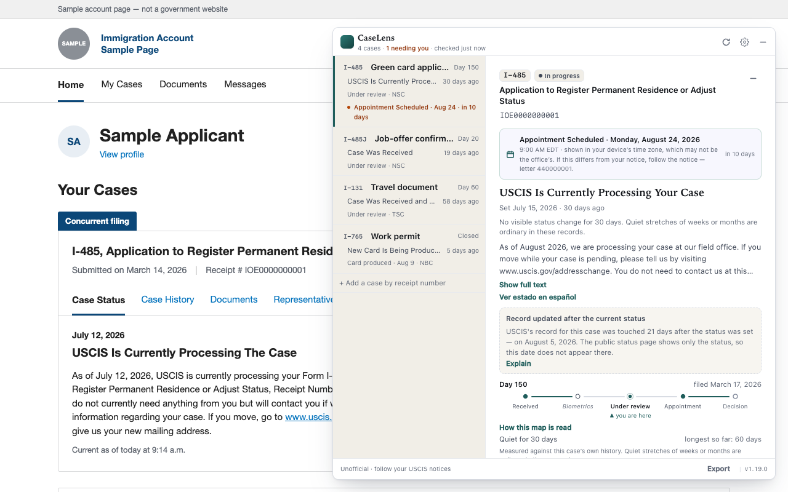

# CaseLens — USCIS Case Tracker

A panel on [my.uscis.gov](https://my.uscis.gov) showing every case on your account in one place: status, a merged timeline, which office holds it, your documents, and what changed since you last looked. Free, open source, stored only in your browser.

**Unofficial and independent.** Not affiliated with, endorsed by, or connected to USCIS or the Department of Homeland Security. Not legal advice. Your mailed notices and my.uscis.gov are the authority on your case — if this panel disagrees with them, believe them.

Sample cases, not real data. <a href="docs/store/04-overview.png">All cases at a glance</a> · <a href="docs/store/03-timeline.png">timeline</a> · <a href="docs/screenshots/panel-dark.png">dark mode</a>.

## Will it work for your case?

Only receipt numbers beginning `IOE`. Other prefixes (`EAC`, `WAC`, `LIN`, `SRC`, `MSC`, `YSC`) are handled in an older USCIS system these endpoints do not reach.

Cases already listed on your account page are picked up automatically. Others can be added by receipt number, the 13 characters printed on your I-797C notice. It reads the cases your own account can see, including family members' cases filed under it. Someone with their own USCIS login installs it on their own account; there is no way to combine two accounts.

Built for a desktop browser window.

## What it shows

Your account page already loads your case data when you open it. CaseLens makes those same requests and lays out every field they return — including fields the page itself does not display — for all your cases at once, rather than one at a time.

That means USCIS's current status in its own wording with its date, the office holding each case, documents on file, scheduled appointments, and days elapsed since filing. Status text is never rewritten. Spanish appears where USCIS supplies it.

The official site does not show which office holds a case, or when USCIS last touched the record while the status wording stayed the same. Both appear here.

Under each open case, **Everything USCIS sent** lists every response in full — one section per endpoint, each field labelled and in USCIS's own order, with the raw JSON one level further down. Nothing is filtered on the way through, so a field USCIS starts returning tomorrow shows up tomorrow.

CaseLens does not predict decision dates and does not characterise a case as going well or badly. Where USCIS publishes a processing estimate for a case, the panel shows how much of that range has passed; otherwise it shows days elapsed.

## Privacy

- **Uses your existing login.** Never sees, asks for, or stores a password.
- **Talks only to my.uscis.gov**, the site you are already signed into. No outside code, fonts or images.
- **Reads only.** It cannot file, answer, withdraw, upload or change anything, and can reach nothing your own account cannot.
- **Cases and history stay in your browser** (`localStorage`). No account, no server, no analytics, no tracking.
- **No permissions beyond running on my.uscis.gov.** The install prompt warns that it can read and change data on that one site. It asks for nothing on any other site, and there is no background process.
- **Three source files.** The published extension is byte-for-byte the code in this repository.

Full detail in [PRIVACY.md](docs/PRIVACY.md). Threat model and limits: [SECURITY.md](SECURITY.md).

## Install

CaseLens installs as a **userscript**. Store versions (Firefox Add-ons, Chrome Web Store) are planned.

A userscript manager can see every site you visit — you are trusting it as well as this tool. The store versions will not need one.

1. **Install a userscript manager.** [Violentmonkey](https://violentmonkey.github.io/) on Chrome, Edge or Firefox, or [Userscripts](https://github.com/quoid/userscripts) on Safari. Both are open source. Tampermonkey also works; turn off "Anonymous statistics" in its settings.
2. **Open the [install file](https://github.com/itsericqiu/uscis-caselens/releases/latest/download/caselens.user.js).** That link always points at the newest tested release, and your copy updates itself from it.
3. **Sign in at [my.uscis.gov](https://my.uscis.gov).** A **CaseLens** pill appears bottom-right. Click it, or press **Alt+U**.

**If nothing appears.** Recent Chrome versions require user scripts to be allowed explicitly. Go to `chrome://extensions`, open your userscript manager's details, and switch on **Allow user scripts**. Until then the script never runs, with no error shown.

## Worth knowing

**"Record was updated."** Every case carries a last-updated timestamp separate from its status. It sometimes moves while the status wording stays the same. The official site does not show this. It means only that the record was touched — not a decision or a new stage.

**Removing a case deletes its history.** USCIS does not publish that history and it cannot be recovered. Export first if you want a copy for your records. Clearing browser site data for my.uscis.gov erases it the same way.

**Export is a records file, not a backup.** It contains everything USCIS returned about your cases on the latest check — names, addresses, and full receipt numbers included, whatever "Hide receipt numbers" is set to — plus every change this panel recorded. There is no import: a new browser reads your account page fresh. Treat the file like a mailed notice.

**Event codes** like `FTA0` or `LDA` are labelled with USCIS's own wording where your case supplies it, otherwise from the federal NIEM schema. Codes in neither are shown as the raw code, and the raw code stays visible alongside any label.

**The changed badge** names what differs from your last visit. "Mark seen" clears it; the entry stays in the timeline.

## What data is accessed

Read-only, using your existing session. These are the same endpoints the official dashboard loads.

| Endpoint | Purpose |
|---|---|
| `/account/case-service/api/cases` | Session check; returns an empty list |
| `/account/case-service/api/cases/{receipt}` | What was filed, when, and when USCIS last touched the record |
| `/account/case-service/api/case_status/{receipt}` | Status wording, status history, office |
| `/account/case-service/api/cases/{receipt}/documents` | Documents on file |
| `/account/case-service/api/cases/{FORM}/processing_times/{receipt}` | Processing estimate, when USCIS publishes one |
| `/secure-messaging/api/case-service/receipt_info/{receipt}` | Second source for office location; usually empty. Returns no messages |

Response shapes and the fields actually read: [docs/API-SCHEMA.md](docs/API-SCHEMA.md).

These endpoints are undocumented. USCIS could change or remove them without warning, which would break the tool until it is updated. Several often return nothing, and processing-time estimates almost always do. Empty means USCIS published nothing there, not that something is broken.

## Questions

**It says my session expired.**
Your USCIS login timed out, as it does on the official site. Sign in again, then choose Refresh.

**Can it check while my browser is closed?**
No. Checks happen only while the my.uscis.gov tab is open and in front of you, which is also the only time a notification can fire. An appointment in the panel will not remind you on its own.

**How do I delete everything?**
**Settings → Erase everything** removes saved cases, stored statuses, the record of what changed, and settings, from this browser only. Nothing at USCIS is touched. Uninstalling alone leaves the storage in place; clear site data for my.uscis.gov instead.

**Someone else uses this computer.**
Anything saved is visible to anyone using the same browser profile, and there is no password on the panel. **Hide receipt numbers** masks what is on screen and **Erase everything** clears it — but on a computer you share, consider not installing it.

## For developers

[`core/uscis-tracker-core.js`](core/uscis-tracker-core.js), [`core/uscis-style.js`](core/uscis-style.js) and [`core/uscis-codes.js`](core/uscis-codes.js) are the only sources. Everything in `userscript/` and `extensions/` is generated by concatenating them, and `node scripts/build.js --check` proves the shipped copies match. Setup, tests, and the rules a change has to follow are in [CONTRIBUTING.md](CONTRIBUTING.md).

[SECURITY.md](SECURITY.md) · [PRIVACY.md](docs/PRIVACY.md) · [docs/design/SPEC.md](docs/design/SPEC.md) · [docs/API-SCHEMA.md](docs/API-SCHEMA.md)

---

Confirm anything that matters with an immigration attorney. [MIT License](LICENSE).
